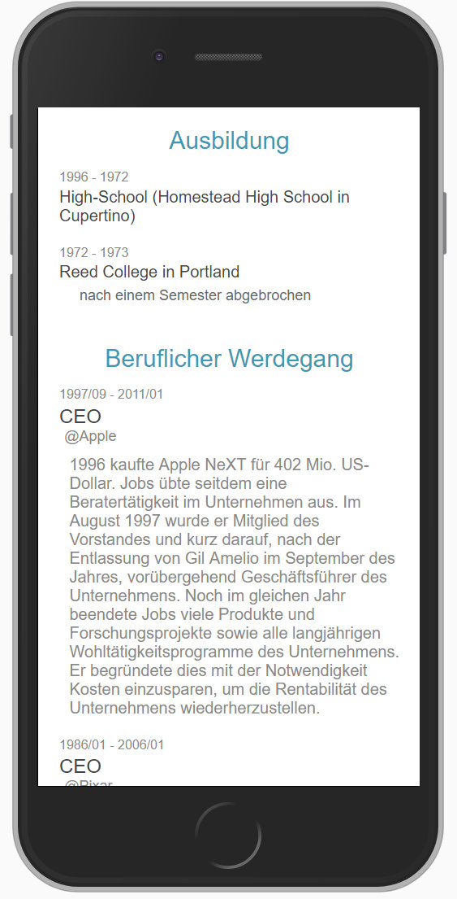
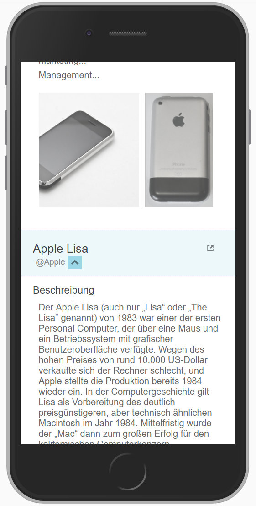
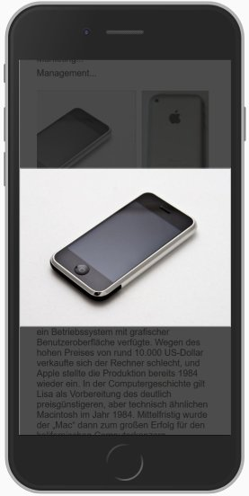
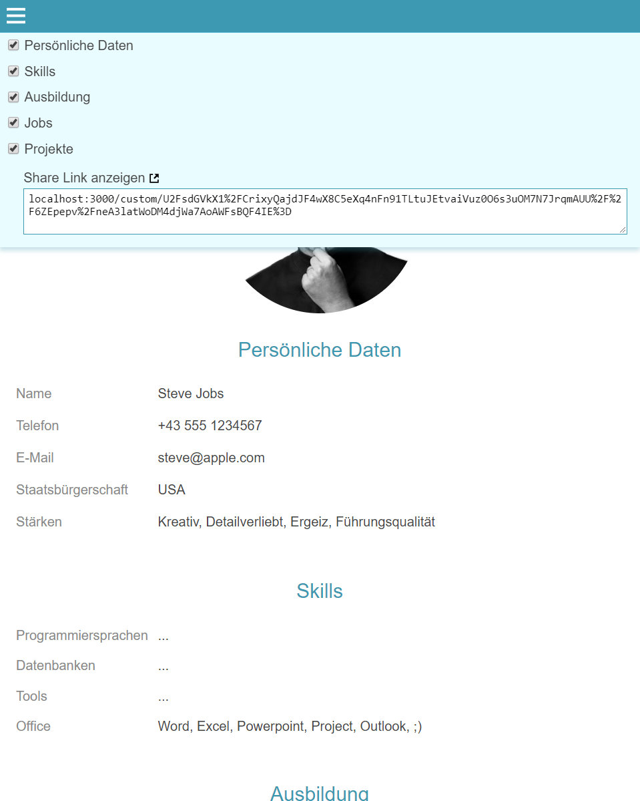

# Custom React CV

## About
The Custom React CV is React Based Progressive WebApp Project. You can costumize your CV App by editing the __data.js__ in the src folder and by putting your images in the __public__ folder.

## How to use
* install Webpack
* install Create React App globally
* run 'npm install' followed by 'npm start'

## Screenshots
Mobile:

Desktop:

